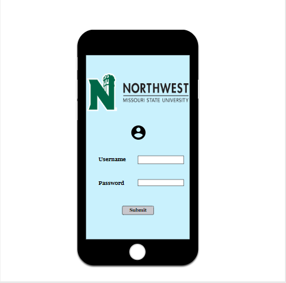

# Project Charter: [GROUP D]

This is the project charter for the Codeword Distributor project.
This application will be delivered as a  iOS application. 

- [View Published Version]()
- [Source Code](https://github.com/anuragkumar96/Project-Charter-Group-D.git)

## Team Collaborators

- Ujjawal Kumar: S530473, Fall 2017, 4th Semester
- Anurag Kumar: S531372 , Spring 2018 , 3rd Semester
- Srimai Reddy Yanala: S531384 , Spring 2018 , 3rd Semester
- Vyshnavi Yalamareddy: S531383 , Spring 2018 , 3rd semester
- Sravya Kancharla: S531500, Spring 2018, 3rd Semester

## Client

Clients include:

- Dr. Charles Hoot, hoot@nwmissouri.edu

## Mentor

Mentors include:

- Dr. Denise Case, dcase@nwmissouri.edu

## Project Purpose
This project involves creating an app that issue confidential codewords to each student in a course. Course instructors must not know what code word is given to each student. 

## Benefits
The application will be important to improve the statistical significance of results from pre- and post-surveys, by allowing instructors to match pre-to-post responses, without compromising the confidentiality of the surveys.

## User Roles
This application is used by Students.

1. Administrator - Dr.Hoot
2. User
3. User stories & acceptance criteria checklist - Vyshnavi Yalamareddy
4. UX sketches & usability - Srimai Reddy Yanala 
5. App framework, architecture, requirements definition (PWA required) - Sravya Kancharla
6. E-R diagram & sample data - Anurag Kumar
7. Coordinate, organize, initialize repository & client contacts, all other - Ujjawal Kumar

## Stories by Role

Administrator Perspective
As a admin, I would like this application to generate the required code without fail as user should get through that easily

Users Perspective
As a user I would like to have a good interface as it looks good
As a user I also would like to get information as soon as I click submit button.

Sravya Kancharla - As a user I want to make an app which can be more specific so that we have competency levels with others.

Vyshnavi Yalamareddy - As a user I want to come up with ways to communicate our ideas so that I can eliminate misunderstandings between client and development team.

Srimai Reddy Yanala - As a user I want to visualize the screen-to-screen interaction admin and user, so that our idea will be visible and clear in user interface form.

Anurag Kumar - As a user I want to collect data and get a good relationships among people, objects, places, concepts or events within that system as I want to be used in computing in regard to the organization.

Ujjawal Kumar - As a user I would be taking care of designing the database and designing ER diagrams, creating database, performing CURD operations, connecting the applications with the database, etc.

## Team Organization

This team is organized as follows.

|                        | Primary              | Secondary            | Content |
| ---------------------- | -------------------- | -------------------- |---------|
| Team Lead              | Ujjawal Kumar        | Sravya Kancharla     | Repo, intro, budget, schedule, risk, coordination   |
| Architect              | Anurag Kumar         | Srimai Reddy Yanala  | E-R diagram |
| Data                   | Sravya Kancharla     | Vyshnavi Yalamareddy | Sample data |
| UX                     | Srimai Reddy Yanala  | Anurag Kumar         | Sketches  |
| Testing & Acceptance   | Vyshnavi Yalamareddy | Ujjawal Kumar        | Stories, acceptance criteria |
## Scope

Our main aim is to

### Phase 1 - Conception and initiation (Module 1)

Phase 1 involves a friendly competition between muliple teams, 
each completing a quick (2-week, 1 module) exercise to develop a vision for the project 
on a given platform. In competitions, this exercise may be done in an afternoon. 
During Phase 1, the teams will work independently and each vision will be shared with the client. 

Deliverables:

- Project charter
- Supporting artifacts (as described in this document)
- Contract (This is an agreement to deliver the project successfully to the client with help of 5 members team in 14 weeks time period with an approximate amount of 5000 dollars)

This phase includes the development of:

- Initial stories by role ()
- Initial acceptance criteria (link)
- Initial E-R diagram (link)

- Initial sample data (https://github.com/ujjwalkumar1212/Project-Charter-Group-D/raw/master/CodeExcel.xlsx)
- Initial project sketches (link - images must be displayed)

## Sketches

### 1. Login Page

Link: https://github.com/ujjwalkumar1212/Project-Charter-Group-D/blob/master/login.png

### 2. Home Page

Link: https://github.com/ujjwalkumar1212/Project-Charter-Group-D/blob/master/Landing.png

- For each phase, initial scope, schedule, budget (included in this document)
As per the schedule by the end of semester we would submit the whole requirements which requires upto $5000.

### Phase 2 - Definition and planning (Module 2 and 3)

During Phase 2, the best parts of each platform-specific charter will be used to create a single, 
consolidated charter that allows different platforms to share fundamental aspects such as the E-R diagram and 
sample data.

Deliverables:

- Combined project charter
- Integrated supporting artifacts (taking the best from Phase 1)

Include:

- Final stories by role (see above)
- Final acceptance criteria (see above)
- Final E-R diagram (link)
- Final set of sample data (link)
- Detailed project sketches by platform (link - images must be displayed)
- Architectural decisions, including platforms, languages, frameworks, libraries, cloud resources, data stores, releases, milestones, authentication, authorization, responsive supports, progressive supports, security, performance requirements, traditional or SPA, client-side rendering vs server-side rendering, REST vs GraphQL, web vs native vs hybrid, etc.
- List of projects with versions in JIRA
- Schedules for sprints, client presentations, milestones and acceptance criteria in JIRA
- Construction of product backlogs built from epics, stories, tasks, and subtasks in JIRA

### Phase 3 - Implementation of architectural prototypes (Module 4 and 5)

During Phase 3, new teams will be defined to work in parallel (again in friendly competition) to build platform-specific architectural prototypes to identify any major issues with the plan. 

Deliverables:

- Updated versions of all artifacts
- JIRA management system
- Working prototype deployed in each proposed platform
- Presentation of architectural prototype to client and extended team (include pros & cons of these choices).
- Together with the client decide what platform(s) will be selected for implementation.
- Client acceptance of the plan

### Phase 4 - System requirement specification (Module 6)

Based on the results and lessons learned during the architectural prototypes, finalize the requirements to be used during the coming implementation phase.

Finalize implementation plan (including all remaining phases along with scope, schedule, and budget by phase).

Deliverables:

- Complete implementation plan for next semester.
- Suggested project organization for next semester.
- Signed acceptance by the client with comments.

## Out of scope

The following items are specifically not included in this scope of work:

## Schedule

The following general schedule will be followed:

- Phase 1 completed and presented at the end of week 2. 
- Client feedback and updates completed at the end of week 3.
- Phase 2 completed and presented at the end of week 7.
- Client feedback and updates completed at the end of week 8.
- Phase 3 completed and presented at the end of week 12.
- Client feedback and updates completed at the end of week 13.
- Phase 4 finalized and published at the end of week 14.
- Client feedback and updates completed at the end of week 15.
- Project reflections and discussions completed during week 16.

You will develop the schedule for next semester as part of this work. 

The complete schedule is shown in the following Gantt chart:
- Display or link to the current project Gantt chart 
- Schedule by work tasks by phase
- Include through final implementation (next semester)
- Include durations, dependencies, and key milestones

## Budget

Present project budget table here. 

- Budget must be by phase by team role.
- For each role, assume each contributor will be working 10-12 billable hours per week for 15 weeks per semester
- Use real-world billing rates. A company must bill you at twice your salary or more - practice proving your worth. 
- Within the team, be specific on what each role will contribute to the budget and how this will be documented.

## Risk

The following have been identified as risks that could contribute to not making scope, budget, or schedule:

- The client changes requirements mid-project...

## Acceptance criteria

- For each story, enumerate and clearly describe the acceptance criteria. 
- Be specific - your client may have a very different definition of vague words. 

